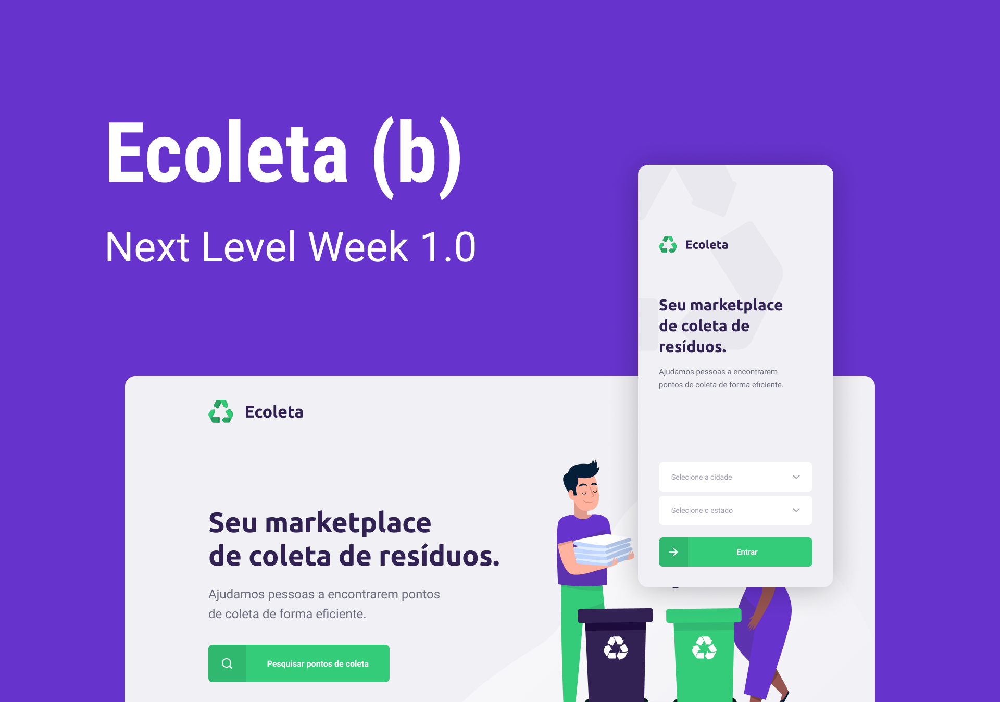

# nlw-1
Projeto construído durante a Next Level Week #01. Aplicativo para compartilhamento e procura de pontos de coleta de dejetos ecologicamente perigosos. 

O projeto foi realizando usando ReactJS no frontend WEB, React Native no frontend mobile e NodeJs no backend. Uma oportunadade de aprendizado INCRÍVEL!!

Deixo meu agradecimento a equipe da Rocketseat por abrir essa porta a comunidade.

